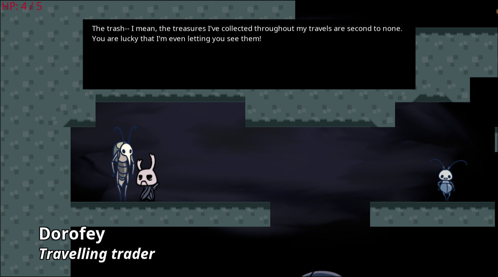
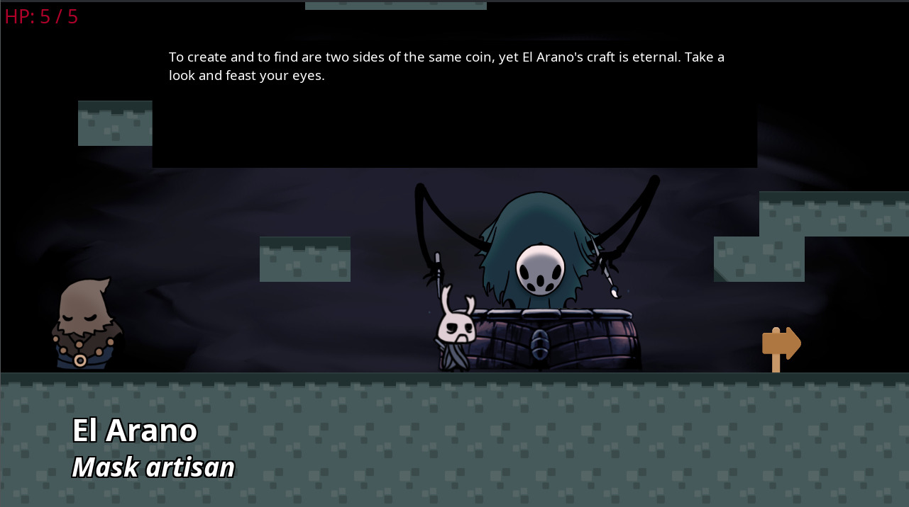
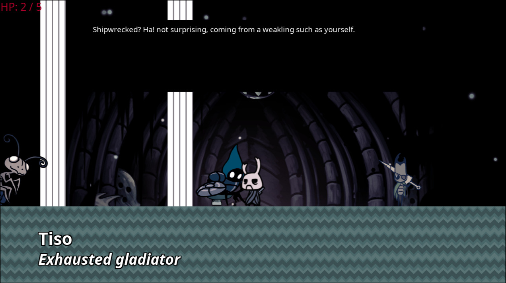
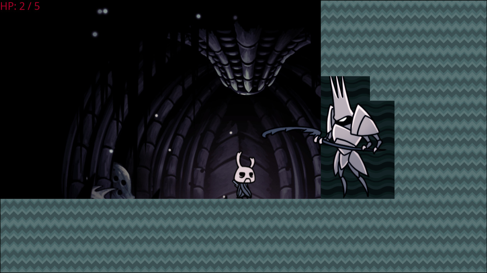
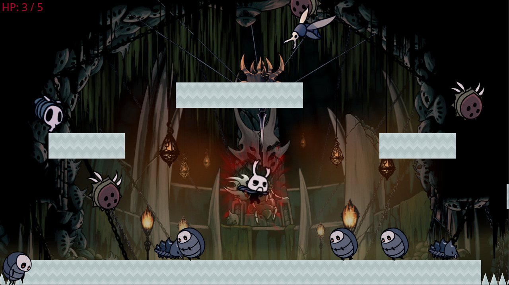
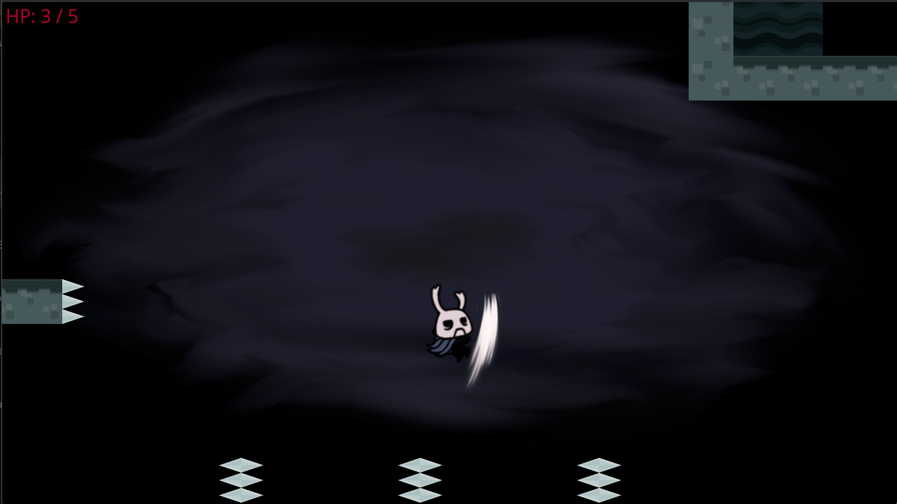

# ZoteBoat

A Python project made for the Applied Informatics 4 course, by a 2-student team -- SIMION Stefan and CIUCA Lucas

ZoteBoat is a small Metroidvania made in Python, that seeks to replicate the feel
of the original Hollow Knight game made by Team Cherry. The game has an open area
to explore and two addicting minigames to master, with most of the features that
are expected of a game of this type. Explore, test your skills and become stronger
while meeting many intriguing characters, some of which are willing to sell you
upgrades to aid you in your travels.

## GitHub Link

https://github.com/RagnarokMew/ZoteBoat

## Tools used

- Python 3.13.7 (3.9+ supported)
- Python Arcade package 3.3.3 (and built-in dependencies such as Pyglet, Pillow, etc)
- Tiled 1.11.2 for map creation
- GIMP 3.0.6 and Gwenview 25.08.3 for image editing
- JSON

## How to use / run

### Before you start

Make sure that in the root of the project you have the following folders:

- `src` - contains the source code of the app
- `saves` - contains the save files of different users
- `assets` - contains all the assets used by the game such as sprites and maps

To run the game you need to go into the `src` folder and run `main.py`:

```bash
cd src
python main.py
```

### Main Menu

Upon booting the game you will be met by the main menu where you will be
presented with multiple options:

- `Play` - jumps into the game with the setting set in options
- `Leaderboard` - view the scores of all local players
- `Credits` - view the credits of the game
- `Options` - change the settings of the game
- `Quit` - exits the game

> **IMPORTANT!**  
> Upon starting the game, you should go to the `Options` menu and set a username.
> The username is saved in the current session, but upon restarting the game it
> also gets reset. If you do not set a username, the `default` user will be enabled.
> Setting a username allows you to save your progress and high scores.  
> While in `Options` you can check if you want to display enemy HP or not. This
> is considered more of a debug setting (Hollow Knight does not normally display them),
> but we believe the user should have the freedom of choice.

### Controls

The control scheme matches the one of Hollow Knight:

- `Arrow keys` - movement keys
- `Z` - jumping; double jumping and wall-jumping (after unlocking)
- `X` - attack
- `C` - dash (after unlocking)
- `Esc` - quit to main menu

Just like with TC's original game, the attack can also be used to jump on enemies,
environment hazards, and even... an NPC?  
Exploration is encouraged, as the map (even if small) has multiple paths you can take,
including a secret room accessible by wall-jumping.

## Media

### Video demos (YouTube):
- [Demo 1 (Intro)](https://youtu.be/nekYXRX8OLQ)
- [Demo 2 (Combat)](https://youtu.be/gecQ2yAiNaA)
- [Demo 3 (Gameplay)](https://youtu.be/0tFsMtioXJ0)

### Gallery:








## Team Contribution

We both worked very hard to bring ZoteBoat to its current state.
The list below is, of course, non-exhaustive.
We encourage anyone curious to explore the Commit history
and PRs on GitHub, or to use `git blame` on the project files.

### RagnarokMew (Stefan Simion 324CC)

- Application entry point
  - Main menu
  - Submenus for play, leaderboards, credits, options, quit
  - Base game view
- JSON loading logic
  - NPC, dialogue, shop
  - Leaderboards
- Player mechanics
  - Player class and basic movement
  - Player attack class and logic
  - Player and attack assets and animations
  - Player stats
- On-screen text
  - Fading text class
  - Player HP, currencies
  - Show enemy hp logic
  - Dialogue and shop text boxes
- NPC mechanics
  - NPC class and spawning
  - NPC dialogue system
  - NPC shop system and data
  - Shop item data
- Enemy mechanics
  - Base enemies and enemy types
  - Enemy movement, AI, animations
  - Enemy assets and data
- Project coordination and codebase maintenance

### Luxaks (Lucas Ciuca 324CC)

- Advanced player mechanics and minigames
  - Dash, wall-jump, double jump, pogo
  - Player stats expansion
  - Parkour scoring (timer)
  - Arena logic and scoring (timer, kill count, enemy spawn, forfeit)
- Spawning / Respawning
  - Map change handler
  - Respawn handler (with multiple cases)
  - Fade in/out
  - Death text
- JSON loading logic
  - Player spawning
  - Player stat saving and loading
  - NPC and enemy spawning expansion
- Game data
  - Player stats
  - Enemy stats
  - NPC stats and dialogue
  - Map data
- Sprite editing
  - Player character assets
  - Player and enemy damaged effects
  - NPC assets
  - NPC animations
  - Tilemaps and tilesets
- Minor enhancements
- Testing and bug fixes

## Implementation Difficulties

### Movement Physics

One of the greatest problems we encountered during development was the
implementation of movement physics.

Originally, we planned to use the Pymunk Physics Engine included with Arcade and
wrote the basic movement mechanics with it, but we had difficulties in making the
player character stop moving as they continued to glide as if the ground was ice
despite setting the friction with the ground to be quite high.

After that we decided to completely rewrite the movement with the Arcade Physics
Engine placing our movement logic in the `on_key_pressed` functions and this
worked well until we implemented the map changing logic and did some testing.
While implementing more complex movement mechanics we discovered that the player
character would (again) glide on the new map despite no movement keys being pressed.

We discovered this was because of Arcade's implementation of key press detection,
which made it so that when the map changed, the character would get a speed opposite
to what they had before the transition. We tried some workarounds like forcefully
decreasing the speeds and preserving the movement separately, but these
interfered with Arcade's functionality and introduced more bugs than it fixed.

As a final resort we once again rewrote the whole movement logic, moving
everything to `on_update` and keeping only the key detection itself, using
specific flags instead of altering the player's speed directly.
This did not come without its own problems, since the old movement system
was rendered entirely obsolete, forcing major rewrites. However, we succeeded
in creating the current implementation, which not only works even better than
before, but can also take the player's state into account (e.g. gameplay vs dialogue).

### Arcade Pixel Coordinates

Another hurdle we encountered was the way Arcade handles coordinates based on
the pixel location on the map.

This was an issue for drawing the shop menu where our implementation is dependent
on rectangle sprites and text objects being drawn on their correct positions.
Due to the lack of precise ways to put them in a Layout we were forced to rely
on a UI centered Camera object which resulted in unmaintainable placement
equations, should we have implemented a changeable screen resolution, despite
attempts to rectify this by using constants such as the screen width and height.

This also affected our tilemaps greatly, since Tiled (the map editor recommended 
for Arcade) uses a different coordinate / grid system compared to Arcade itself,
which caused us to have to play around with the coordinates to get them right
(i.e. brute forcing the correct position through trial and error,
which slowed down tilemap creation by a lot).

### Goals, Planning, Resolutions

We were overly ambitious in our initial goals and our original implementation plan
was unclear. Some features needed rewriting, others took more time and research than
anticipated, and over time we also added features that weren't originally planned.
All of this threw us off schedule and we had to cut corners (the other 2 minigames
that were originally planned). Furthermore, some aspects that appeared simple in concept
proved much more difficult in practice, both due to our lack of familiarity with the
tools used (specifically, neither of us had made a game using Arcade and Tiled before),
as well as due to Python's own intricacies and the problems that arise naturally
in such a big project.

Regarding the components of our game, each part was developed in a separate
Git branch. However, there were frequent overlaps between these branches, such as when
different code was required in the same file or when a component became outdated
from whatever reason. As such, more effort was needed to resolve these conflicts;
but, with determination and good communication, we managed to fix the code
and make it run properly with relative ease, so the final result is a game
that works exactly as intended.

Despite all of our difficulties, we are not disappointed with the final result.
We have achieved and learnt a lot about developing a project of this scope,
so our effort yielded nothing short of a great success.

## Crediting

Most assets (character and enemy sprites) were created by [Team Cherry](https://www.teamcherry.com.au/).
Further editing was done on some of these (for animations) primarily using Gimp.

Other assets (platform and environment tiles) were taken from the Arcade package
[built-in resources](https://api.arcade.academy/en/stable/api_docs/resources.html).

Shipwreck background originally by [Andrey Bezrodnykh](https://www.artstation.com/artwork/AxyDX).
