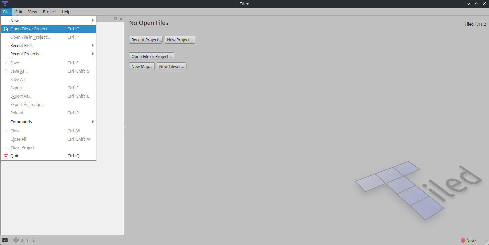
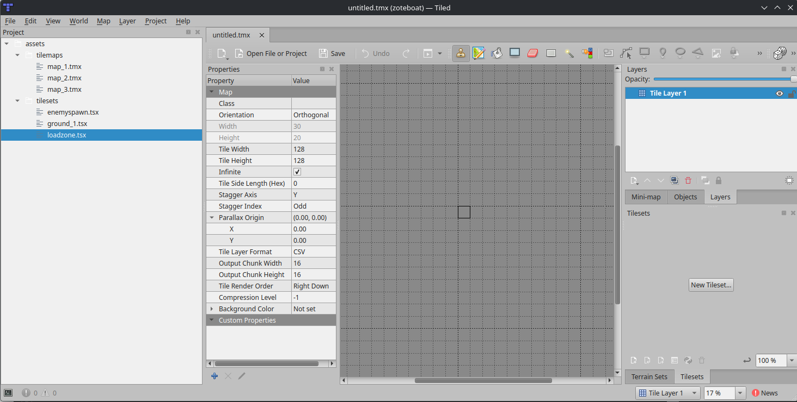
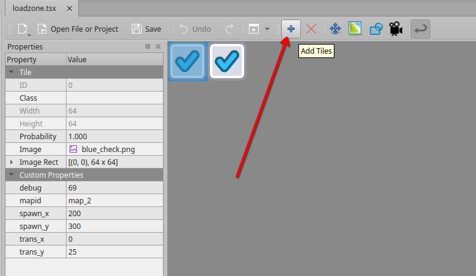

# On the Subject of Tilemaps

The below document will detail the functionality and usage of the program known as Tiled, for creating maps for ZoteBoat. The complete documentation can be found [here](https://doc.mapeditor.org/en/stable/).

## Installation & Running

In order to create tilemaps, you must first install [Tiled from itch.io](https://thorbjorn.itch.io/tiled). For Linux systems, the AppImage version is the only one available. However, if you do not want to actually install the AppImage, you can instead unpack it using a command which will look like this:

`./Tiled-1.11.2_Linux_Qt-6_x86_64.AppImage --appimage-extract `

This will create a new directory containing the executable files. Finally, run either `AppRun` or `AppRun.wrapped`. Congrats! You are now ready to start making maps for our beautiful game.

## Creating a New Tilemap

Once Tiled is run, you will be greeted by this screen:

To begin, click `File > Open File or Project...` or `Ctrl+O` and open `zoteboat.tiled-project`. This file doesn't do much, except enable you to navigate the filesystem in the built-in panel on the left.

Then, to create a new map for whatever area you want, click `New Map...` (or `File > New`) and save it under `assets/tilemaps` with the `.tmx` extension. The tile size should be 128x128 px. The map size can be infinite, since it doesn't affect performance, although you could restrain yourself if you want :)

To move around the main view, use the scroll bars on the right and below (sadly, touchpad scrolling seems inconsistent). To zoom in/out, `Ctrl+scroll` will do the trick.

## Adding Tiles

First, open whichever *tileset* you want to add tiles from (double click the file in the left panel). You can also create a new tileset if you need to. A tileset is created similar to a map; however, make sure it is a **collection of images**, which allows you to add any sprites you want instead of relying on a spritesheet.

Then, return to the map tab (while leaving the set tab open). Tiles will now be available in the lower-right corner. To add them to your map, just click the tile you want, then click on the grid. To erase tiles, use the *eraser* (`E`); then, to return to painting mode, either use the *brush* (`B`) or click a new tile.

You may notice, while adding elements to a tileset, that sometimes, some tiles will appear in the wrong place. Don't worry, this is a bug with Tiled's encoding of the map; just add and remove a tile to your map and save it again to fix it.

## Layers

You will notice that so far, all tiles will live on the same layer. To give our scene depth (and to later allow for special-purpose tiles), create a new *tile layer* by right-clicking on the upper-right panel, and selecting `New > Tile Layer`. The naming and order of the layers should be as follows:

* Foreground
* Enemy Spawn <i style="font-size:11px;">&emsp;&emsp;(optional)</i>
* Load Zone
* Wall Jump <i style="font-size:11px;">&emsp;&emsp;&emsp;&emsp;(optional)</i>
* Platforms

Once you have your layers, click on the one you want to draw on, and start drawing the tiles.

Quite obviously, the `Platforms` layer contains the platforms: ground and walls. The `Load Zone` and `Enemy Spawn` layers contain special tiles (detailed later) and should be made invisible (but you can leave them visible in the tilemap, the change can be made in code as well). Similarly, `Wall Jump` will contain special tiles which enable Zote to jump on walls. These can be omitted if an area is designed to be traversed otherwise. Lastly, `Foreground` is purely for visuals, so it can be empty (but it must be added for proper setup).

## Specil Tiles

### Loadzones
The `loadzone.tsx` file (or a similar one) will contain sprites for handling scene transitions. Technically, the sprites can be anything, as they will be hidden anyway. The only important part is having the following attributes:

* `mapid` : name of the next room
* `spawn_x` , `spawn_y` : spawn coordinates
* `trans_x` , `trans_y` : transition speed (optional)

These attributes should be of type `int`, with the exception of the first one, which is `string`. Importantly, the map name is ***the same*** as the tilemap file's name, without the `.tmx` extension.

To create a new transition, simply add a new sprite to the set using the plus button: 

Then, add the properties by right-clicking `Custom Properties` then clicking `Add Property`.

Finally, place the tiles on the `Load Zone` layer of your map.

### Enemy Spawning

The enemy spawn tiles are *very* similar to the transition tiles. The only exception is the attribute, which should be called `enemy_type` and be of type `string`. This will contain the name of the enemy to be spawned, which will be referenced in code.

### Wall Jumping

Lastly, wall jump tiles. There will be exactly two of these (left and right). There are no special properties or other information about these tiles, as there is no need to create any more besides the two. Just use them whenever needed! :)

## Ending Notes

After doing everything in this tutorial, you should have a complete tilemap. Happy building!